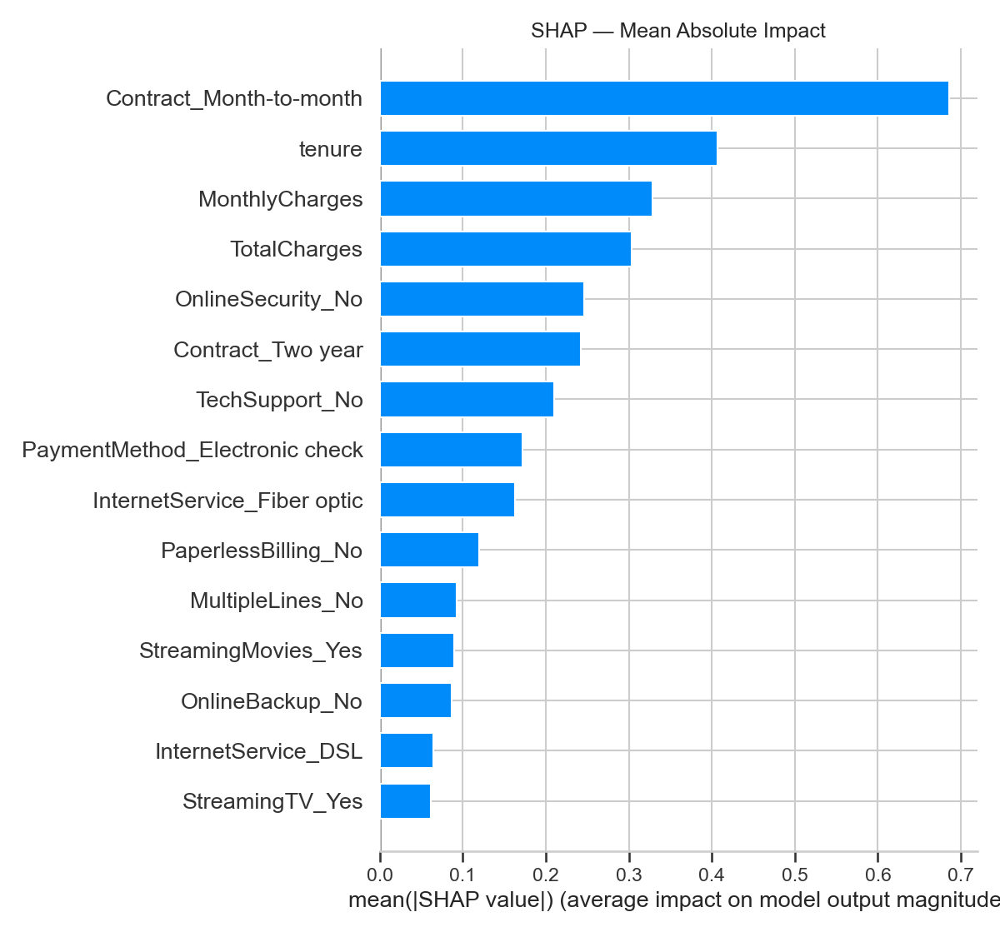

# 🔄 Churn Consulting — Customer Churn Prediction & Retention Optimization

> End-to-end data science project simulating a full consulting deliverable:
> from EDA to production-ready ML pipeline, CRM segmentation, and business case.

🚀 **Live Demo** : [churn-consulting-njgo.streamlit.app](https://churn-consulting-njgo.streamlit.app)  
💻 **GitHub** : [github.com/OJules/churn-consulting](https://github.com/OJules/churn-consulting)

---

## 🎯 Key Results

| Metric | Value |
|---|---|
| Model | XGBoost + Isotonic Calibration |
| AUC-ROC | **0.842** |
| Recall on churners | **78%** |
| Brier Score improvement | **-16%** after calibration |
| High-risk segment (A) | **86 clients** (~6% of base) |
| Estimated revenue at risk | **$96,748 / year** |
| Estimated ROI (20% conversion) | **1,400%** |

---

## 🧩 Business Problem

Acquiring a new customer costs 5–7x more than retaining an existing one.
This project answers four business questions:

- Which customers are most likely to churn?
- What factors explain this risk?
- Which at-risk customers should be prioritized by value?
- What is the estimated ROI of a targeted retention campaign?

---

## 📦 Dataset

**Telcom Customer Churn Dataset** — Kaggle (Mosap Abdel-Ghany)
- 7,043 customers · 21 features
- Demographics, contract type, services, billing
- Binary target: `Churn` (Yes/No)

---

## 🛠️ Stack

Python · Polars · Scikit-learn · XGBoost · SHAP · MLflow · Streamlit · Plotly

---

## 📐 Project Structure

```
churn-consulting/
├── data/                  # Raw and scored datasets
├── notebooks/             # EDA, preprocessing, modeling, calibration, business case
├── src/                   # Production-ready modules
│   ├── config.py          # Paths and column definitions
│   ├── data_loader.py     # Data loading and casting
│   ├── features.py        # Feature engineering (CLV, NbServices, etc.)
│   ├── train.py           # Full training pipeline
│   ├── evaluate.py        # Metrics and calibration plots
│   └── inference.py       # Scoring and segmentation
├── models/                # Saved artifacts (preprocessor, XGBoost, SHAP explainer)
├── app/                   # Streamlit dashboard (4 pages)
├── report/                # SHAP plots, segmentation charts
└── mlruns/                # MLflow experiment tracking
```

---

## 🔬 Methodology

### 1. EDA
- Global churn rate: **26%** → class imbalance identified
- Key signals: contract type, internet service, tenure, payment method

### 2. Preprocessing
- `ColumnTransformer` with `StandardScaler` + `OneHotEncoder`
- Stratified train/test split (80/20)
- 3 numerical + 16 categorical → **46 features** after encoding

### 3. Modeling
- Baseline: Logistic Regression (AUC 0.842)
- Main model: XGBoost with `scale_pos_weight=2.77` (AUC 0.840, Recall 78%)
- Experiment tracking with MLflow

### 4. Calibration
- Isotonic regression via `CalibratedClassifierCV` (5-fold CV)
- Brier Score: 0.1709 → **0.1438** (-16%)

### 5. SHAP Interpretability
- Top features: `Contract_Month-to-month`, `tenure`, `MonthlyCharges`
- Local explanations available per customer

### 6. CRM Segmentation
- `CLV = MonthlyCharges × tenure`
- `RetentionPriority = ChurnProbability × CLV`
- 3 segments: **A (High)**, **B (Medium)**, **C (Low)**

### 7. Business Case
- Segment A: 86 clients, $96,748 revenue at risk/year
- Campaign cost: $1,290 (at $15/client)
- ROI at 20% conversion: **1,400%**

---

## 🚀 Run the Dashboard

```bash
pip install -r requirements.txt
python -m streamlit run app/streamlit_app.py
```

---

## 📊 SHAP Feature Importance



---

## 💡 Business Insights

1. **Contract type is the strongest churn driver** — month-to-month customers churn at 42% vs 3% on two-year contracts. Priority action: incentivize long-term contract upgrades.

2. **Fiber optic is paradoxically high-risk** — 41% churn rate on the premium service. Suggests a pricing or perceived value issue worth investigating.

3. **The first 12 months are critical** — 48% churn rate in year 0, dropping steadily to 2% after year 5. Onboarding and early engagement programs are the highest-leverage intervention.

4. **Absence of security services signals churn** — customers without OnlineSecurity or TechSupport are significantly more likely to leave. Cross-selling these services reduces churn risk.

---

## 📋 Deliverables

| Deliverable | Format | Audience |
|---|---|---|
| Documented notebooks | Jupyter | Data scientist |
| Modular sklearn pipeline | `src/` | Data engineer |
| Saved ML artifacts | `models/` | MLOps |
| Interactive dashboard | Streamlit | Marketing team |
| Business case & ROI | Notebook 05 | Management |
| README with Key Results | Markdown | GitHub / Recruiter |

---

## 👤 Author

**Jules Géraud Odje**  
Data Scientist · [github.com/OJules](https://github.com/OJules)